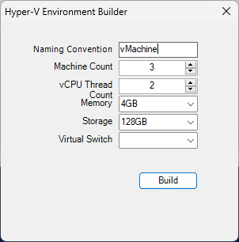

## Hyper-V Environment Builder

This PowerShell script is a GUI application for automating the creation of virtual machines in a Hyper-V environment.

## Features

- **User Interface**: The script utilizes Windows Forms to create a graphical interface with labels, textboxes, numeric up-down controls, and buttons.
- **Configuration Options**: Users can specify the count of virtual machines, CPU count, memory size, storage size, and virtual switch selection.
- **Functionality**: The script performs actions such as creating virtual machines with specified configurations, setting CPU parameters, and removing the environment.

## How to Use

1. **Running the Script**: Execute the script in a PowerShell environment.
2. **Interacting with the GUI**: Use the graphical interface to input desired settings for the virtual machines.
3. **Prerequisites**: Ensure that Hyper-V is enabled on the host system.

## Code Structure

- `InitializeComponent`: Sets up the graphical user interface using Windows Forms.
- `new-vms`: Creates virtual machines based on user-specified configurations.

## Usage Examples

- Specify different configurations for virtual machines, such as varying CPU counts and memory sizes.

## Notes and Considerations

- **Limitations**: This script may have limitations or known issues, which are detailed in the repository.
- **Contributing**: Contributions, such as bug reports or feature suggestions, are welcomed to the project.

## References

- [Hyper-V Documentation](https://docs.microsoft.com/en-us/virtualization/hyper-v-on-windows/)
- [PowerShell Documentation](https://docs.microsoft.com/en-us/powershell/)

## Authors

- [@upioneer](https://www.github.com/upioneer)
